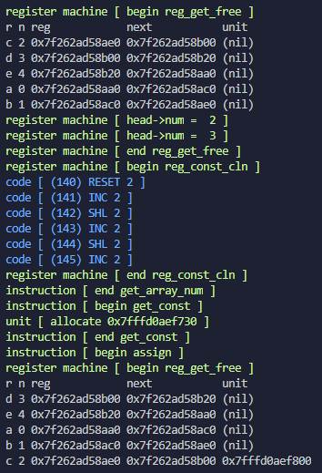

<center> <h1>Compiler | 2020</h1> </center>

## Table of Contents
- [](#)
  - [Table of Contents](#table-of-contents)
  - [About The Project](#about-the-project)
  - [Prerequisites](#prerequisites)
  - [Installation](#installation)
  - [Debugger](#debugger)
  - [Optimizer](#optimizer)
  - [Errors](#errors)
  - [Tests](#tests)


## About The Project
Compiler is a implementation of simple imperative-language compiler. Program uses flex and bison frameworks to generate lexer and parser. Compiler takes full advantages of OOP paradigm of C++ to generate parsing tree, perform arithmetic and logical optimizations and report lexical errors. Program has built-in debugger that can be configured by user. You can read more about it below. Numeric value can be a natural number of any precision, stored in variable or array. Array indices are user-specified and can be negative.  
Warning! Program compiles source file into assembler representation. To run assembler code, make sure to compile virtual machine during installation step. You can find language documentation and examples of source files [here](/documentation.pdf).

## Prerequisites
Below is a list of tools and their versions used in the compiler. Compiler should also run on newer versions of that tools as well.
* g++ 9.3.0
* bison 3.7.3
* flex 2.6.4
* GNU Make 4.2.1
* libcln-dev 1.3.6


## Installation
Before project compilation make sure that you have installed all the required prerequisites. In particular you need cln library to perform arithmetic on natural numbers with infinite precision:
```sh
sudo apt-get install libcln-dev    # cln
make                               # compile
make clean                         # clean

make -C ./virtual_machine          # compile vm
make clean -C ./virtual_machine    # clean vm

./temp <src> <dest>                # compile src file to assember
maszyna-wirtualna-cln <dest>       # run assembler code
```

To perform full cleaning, including generated executable, you can run code below:
```sh
make cleanf                  # full clean (including ./temp)
```

## Debugger
The compiler has a built-in debugger that you can configure to suit your needs. By default debugger is disabled. To enable all debugger features, you have to add `DEBUG_MODE` macro into source files. The easiest way to do it is to set environment variable:
```sh
export FLG="-D DEBUG_MODE"
```
You can also more precisely specify which part of compilation process you want to debug. For example, to debug symbol table run code below:
```sh
export FLG="-D DEBUG_SYMBOL_TABLE"
```
After successful debugging, you can restore default settings, running:
```sh
unset FLG
```
You can find list of all possible debug modes in [debugger.hpp](/debugger/debugger.hpp).
Remember to put environmen variable value inside double quotes. Also take into accout that you need to clean and recompile project after changing `FLG` variable. Below is example of compiler output in debug mode.  


## Optimizer
By default all implemented optimizations are enabled. Sometimes, it is necessary to turn off some of then, for example during bug fixing. You can disable all compiler optimization by setting `FLG` variable before project compilation:
```sh
export FLG="-D OPTIMIZER_OFF"
```
Then you can more precisely specify which optimization to use.
For example, to optimize only the difference operator, run:
```sh
export FLG="-D OPTIMIZER_OFF -D OPTIMIZE_DIF"
```
You can find list of all optimizations in [optimizer.hpp](/optimizer/optimizer.hpp). Remember to unset `FLG` variable at the end to resore all optimizations again.
```cpp
...
#ifdef OPTIMIZER_ON
    #define OPTIMIZE_POSTPONE
    #define OPTIMIZE_SUM
    #define OPTIMIZE_DIF
    #define OPTIMIZE_MUL
    #define OPTIMIZE_DIV
    #define OPTIMIZE_MOD
    #define OPTIMIZE_CONDITIONS
    #define OPTIMIZE_FLOW
#endif
...
```


## Errors
During compilation program can reports some errors, for example lexical error, incorrect use of the operator, attempting to index variable instead of array and many more.
List of all reported errors you can find in [errors.hpp](/debugger/errors.hpp). In addition, compiler can warn you long begore the error is reported and the execution aborted. For this purpose it performs runtime checks and generates warnings, that informs about invalid register identifier, incorrect memory address and many other. All check operations are inline macros, listed in [warnings.hpp](/debugger/warnings.hpp).  


## Tests
You can use [testsingle](/testsingle.sh) and [testall](/testall.sh) scripts to perform unit tests on compiler. More than 150 tests you can find in [tests](/tests) directory.
Scripts assumes that you have path to virtual-machine inside `PATH` variable. If not, run code below:
```sh
cd ./virtual_machine
export PATH=$PATH:$(pwd)
cd ..
```